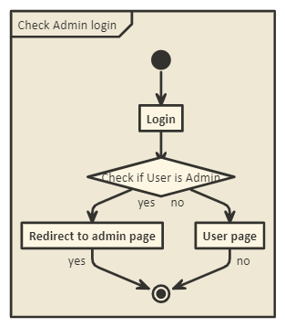

# UML-Representation
 Sample UML represtation


## What is UML?
* Unified Modeling Language, a standard language for designing and documenting a system in an object-oriented manner.

* Communicating language between technical architects and developers

* Diagram also express design of a software achictecture

* It has few diagram which is explained below
    * Activity Diagram
    * Use case diagram

### Activity Diagram

Activity diagram used to capture complicated process flows in project

Tools Used http://www.nomnoml.com/

```
[<frame>Check Admin login |
[<start>st]->[Login]
[Login]->[<choice>Check if User is Admin]
[Check if User is Admin] yes ->[Redirect to admin page]
[Check if User is Admin] no ->[User page]
[Redirect to admin page] yes ->[<end>e]
[User page] no ->[<end>e]
]```

