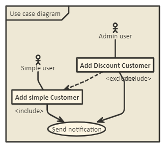
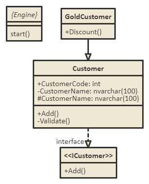
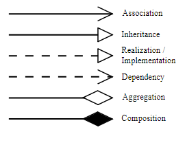
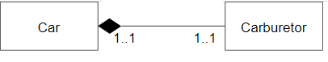
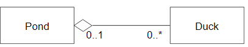
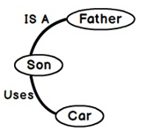

# UML-Representation
 Sample UML represtation

## What is UML?

* Unified Modeling Language, a standard language for designing and documenting a system in an object-oriented manner.

* Communicating language between technical architects and developers

* Diagram also express design of a software achictecture

* UML diagram has 2 types
    * Structural 
    * Behavioral 

* Below are few important diagram which is used frequently
    * Class diagram (Structural type) 
    * Activity Diagram (Behavioral type)
    * Use case diagram (Behavioral type)
    * Sequence diagram (Behavioral type)

### Activity Diagram

Activity diagram used to capture complicated process flows in project

  

Copy below code in http://www.nomnoml.com/

``` nomnoml
[<frame>Check Admin login |
[<start>st]->[Login]
[Login]->[<choice>Check if User is Admin]
[Check if User is Admin] yes ->[Redirect to admin page]
[Check if User is Admin] no ->[User page]
[Redirect to admin page] yes ->[<end>e]
[User page] no ->[<end>e]
]
```

### Use case diagram

Use case diagram has divided to 3 types
* Scenario
* Actor
* Use Case

Actor is two types
* Primary (Simple user)
* Secondary (Admin user)

Include and Exclude deines relationship between use case

  

Copy below code in http://www.nomnoml.com/

``` nomnoml
[<frame>Use case diagram |
[<actor>Simple user] - [Add simple Customer]
[<actor>Admin user] - [Add Discount Customer]
[Add Discount Customer] <extend> --> [Add simple Customer] 
[Add simple Customer] <include> -> [<usecase>Send notification] 
[Add Discount Customer] <include> -> [<usecase>Send notification] 
]
```

### Class diagram

Class diagram is our prototype which helps us to create objects

 

#### Visiblity member

|||
|--|--|
| public |  + |
| private |  - |
| protected |  # |
| Abtract class  | {} |
| Interface |  <<>> |

Copy below code in http://www.nomnoml.com/

``` nomnoml
[Customer]--:>interface[<<ICustomer>>|+Add()]
[Customer|+CustomerCode: int;-CustomerName: nvarchar(100);#CustomerName: nvarchar(100)|+Add();-Validate()]
[GoldCustomer|+Discount()]-:>[Customer]

[<abstract>{Engine}||start()]
```

#### Relation notation



#### Instance-level relationships

##### Composition



 A Car has exactly one Carburetor, and a Carburetor is a part of one Car. Carburetors cannot exist as separate parts, detached from a specific car.

##### Aggregation



A Pond has zero or more Ducks, and a Duck has at most one Pond (at a time). Duck can exist separately from a Pond, e.g. it can live near a lake. When we destroy a Pond we usually do not kill all the Ducks

#### Notation

|||
|--|--|
|0	 | No  instances (rare) |
|0..1 | 	No instances, or one instance |
|1	 | Exactly one instance |
|1..1 | 	Exactly one instance |
|0..* | 	Zero or more instances |
|*	 | Zero or more instances |
|1..* | 	One or more instances |

#### Identify relationships between entities



Relationships that exist in real world, they are of primarily of two types “IS A” and “HAS A”.

For example son “IS A“ child of his father and son “HAS A” a car gifted by his father. “IS A” is more of a parent child relationship (hierarchical) while “HAS A” is more of a using relationship(Aggregated , Composed and Associated).

Other example:
"an oak is a type of tree", "an automobile is a type of vehicle"

IS A : Inheritance (Parent child relation) <br/>
HAS A : Aggregation, Compostion and Associated (Using relationship)